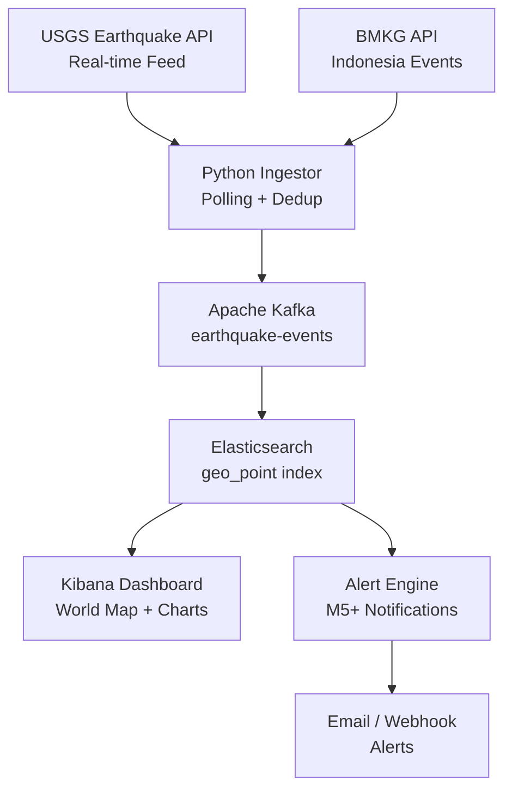

# Earthquake Monitor — Elasticsearch + Kibana


Real-time global earthquake monitoring system that streams seismic event data from USGS and BMKG APIs, indexes into Elasticsearch with geospatial mapping, and visualizes on Kibana dashboards with magnitude heatmaps and real-time alerting for M5.0+ events.

## Architecture



## Features

- Polling USGS and BMKG APIs every 60 seconds for new events
- Elasticsearch geospatial indexing with `geo_point` type
- Kibana geo heatmap showing earthquake density globally
- Magnitude-based severity classification (Micro/Minor/Moderate/Strong/Major)
- Real-time alerting for M5.0+ earthquakes via email/webhook
- Historical data backfill for the past 30 days on startup
- Deduplication using USGS event IDs

## Tech Stack

| Layer | Technology |
|-------|-----------|
| Data Sources | USGS + BMKG Earthquake APIs |
| Message Bus | Apache Kafka |
| Search & Index | Elasticsearch 8.x |
| Visualization | Kibana 8.x |
| Alert Engine | Python + SMTP |
| Infrastructure | Docker Compose (ELK Stack) |

## Prerequisites

- Docker & Docker Compose (6GB+ RAM for ELK stack)
- Python 3.10+
- (Optional) SMTP credentials for email alerts

## Quick Start

```bash
git clone https://github.com/zulham-tech/earthquake-monitor-elasticsearch-kibana.git
cd earthquake-monitor-elasticsearch-kibana
docker compose up -d
python ingestor/run.py  # starts polling USGS + BMKG
# Kibana: http://localhost:5601
# Import dashboard: kibana/earthquake_dashboard.ndjson
```

## Project Structure

```
.
├── ingestor/            # USGS + BMKG API pollers
├── kafka/               # Producer + consumer configs
├── elasticsearch/       # Index mappings + ILM policies
├── kibana/              # Dashboard export (ndjson)
├── alerts/              # M5+ alerting engine
├── backfill/            # Historical data loader
├── docker-compose.yml
└── requirements.txt
```

## Author

**Ahmad Zulham** — [LinkedIn](https://linkedin.com/in/ahmad-zulham-665170279) | [GitHub](https://github.com/zulham-tech)
